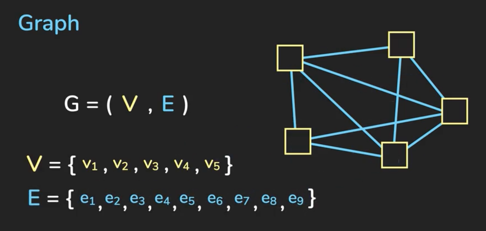
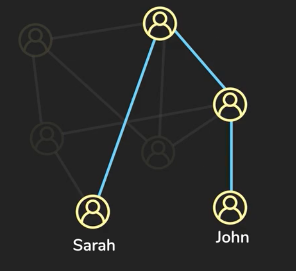

# Graphs
A graph consists of a set of nodes (also known as "vertices") which are connected by "edges". They are defined by a set of vertices and a set of edges whereby each vertex defines the nodes and each edge defines the vertices they join. 



Each edge would be a tuple of vertices which defines the start and the end of the edge, eg

```
e1 = (v1, v2)
e2 = (v2, v4)
...
```

There are 2 types of edges: directed and undirected. A directed edge specifies which way the edge points wheres an undirected edge does not.

An example use of a directed edge would be a tree where a parent points to the child nodes but a child cannot point up to the parent.

A graph that uses directed edges is called a "Directed Graph" (or Digraph for short).

## Use cases
Undirected graphs are useful to describe relationships between nodes. An example of this is social media where the vertices are users and edges are relationships between users. So questions like "what is the shortest path between Sarah and John?"



Directed graphs are useful to model hierarchy or constraints: eg dependencies. 

Weighted graphs place a value on an edge for example a map where locations are the vertices and roads are the edges. Not all roads are equal (eg they have different distances, speed limits, traffic) so a weighted edge would place some metric, which an algorithm would take into consideration when calculating the fastest route to the destination. 